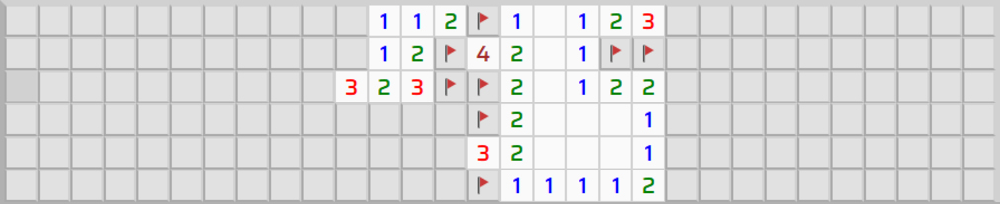

# REACTJS Entrega de proyecto - Buscaminas

Este proyecto es la evolución de un juego de **Buscaminas** desarrollado [originalmente en JavaScript nativo](https://github.com/Grancanash/buscaminas), ahora reconstruido íntegramente utilizando **React** y **Tailwind CSS v4**. El objetivo principal ha sido la **modularización** del código y la optimización de la experiencia de usuario (UX) tanto en escritorio como en dispositivos móviles.

🚀 **[Ver Demo en Vivo](https://grancanash.github.io/REACTJS-Entrega-de-proyecto/)**

---

## 🛠️ Tecnologías Utilizadas

- **React 18**: Biblioteca principal para la construcción de la interfaz declarativa basada en componentes y hooks.
- **Vite**: Herramienta de construcción (build tool) para un desarrollo ultra rápido y optimización de activos.
- **Tailwind CSS v4**: Motor de estilos de última generación, utilizando arquitectura basada en CSS-first y variables de tema nativas.
- **LocalStorage API**: Para la persistencia de los récords personales (mejores tiempos) por cada nivel de dificultad.

---

## ✨ Características Principales

### 1. Arquitectura Modular y Limpia
Siguiendo el principio de **Separación de Incumbencias (SoC)** y **Responsabilidad Única**, el proyecto se ha dividido en módulos independientes:
- **Logic**: Algoritmos puros (Fisher-Yates para barajado uniforme y expansión recursiva de celdas vacías).
- **Components**: Interfaz dividida en piezas reutilizables (`Cell`, `Dashboard`, `ModalInstructions`, `ModalDifficulty`).
- **Styles**: Implementación de la escala numérica de Tailwind 4 y utilidades personalizadas para imitar bordes 3D retro.

### 2. Optimización Móvil (UX Avanzada)
Se han implementado soluciones específicas para garantizar que el juego sea perfectamente jugable en pantallas táctiles:
- **Responsive Adaptativo**: El tablero cambia dinámicamente su estructura en móviles (Ej: El nivel experto pasa de 30 columnas a 10) para evitar el scroll horizontal y permitir el juego en vertical.
- **Detección de Intencionalidad (Touch Slop)**: Un algoritmo personalizado distingue entre el gesto de hacer scroll y el de pulsar una celda, evitando detonaciones accidentales de minas al navegar por tableros grandes.
- **Doble Pulsación Híbrida**: Soporte para marcar banderas mediante doble toque en móvil y click derecho tradicional en PC.

### 3. Interfaz de Usuario Pulida
- **Transiciones suaves (Fades)**: Modales y paneles de información con efectos de desvanecimiento mediante estados declarativos.
- **Scroll Automático**: Al finalizar una partida (victoria o derrota), la aplicación desplaza la vista automáticamente hacia el panel de resultados.
- **Diseño Retro-Moderno**: Estética basada en el clásico de Windows con fuentes digitales y bordes 3D, optimizada para la web moderna.

---

## 🏗️ Estructura del Proyecto

```text
src/
├── assets/          # Imágenes (SVG) y Fuentes locales (Saira, Digital7)
├── components/      # Componentes de React (Cell, Dashboard, Modales)
├── logic/           # Algoritmos del juego (buscaminas.js)
├── App.jsx          # Orquestador principal del estado y la aplicación
└── index.css        # Configuración de Tailwind 4 y estilos base
